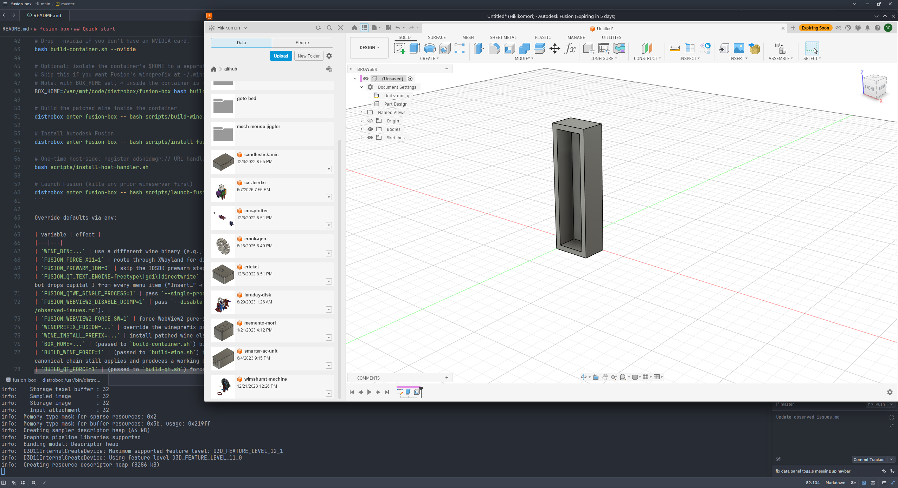

# fusion-box

Experimental: patched wine 11.10 (winewayland.drv) + DXVK in a distrobox container to run Autodesk Fusion natively on Wayland.

Refer to [cryinkfly's project for a more stable/tested Autodesk Fusion on Linux experience](https://codeberg.org/cryinkfly/Autodesk-Fusion-360-on-Linux)



Primarily tested on:
- **OS:** Bazzite 44 Kinoite, NVIDIA Open image (`bazzite-nvidia-open-44.20260605`; Fedora 44 atomic base, kernel `7.0.9-ogc3.2.fc44` - Bazzite's CachyOS-derived optimized kernel)
- **Desktop:** KDE Plasma 6.6.5 (Wayland session, KWin compositor)
- **GPU / driver:** NVIDIA GeForce RTX 3090 Ti, NVIDIA Open driver 610.43.02 (via Bazzite's `nvidia-open` image - no manual driver install)
- **Container runtime:** podman 5.8.2 + distrobox 1.8.2.4
- **In-container stack:** Arch base, patched wine 11.10 (winewayland.drv) + DXVK 2.x via `winetricks dxvk`

The combination most likely to expose bugs is KDE Plasma + KWin on NVIDIA - KWin's stricter subsurface compositing exposes wine bugs that Mutter (GNOME) handles more gracefully, and the NVIDIA driver's Wayland WSI is less mature than Mesa's. If you're on Mutter or AMD/Intel + Mesa, you may see fewer of the issues listed under "Known Issues".

## Why?

I had attempted to use a Win10 VM with GPU passthrough via VFIO, but it was a 50/50 chance it would lock my system up (GPU binding/unbinding would fail with kernel errors).
I already use distroboxes heavily so Autodesk Fusion on distrobox sounded like a great replacement.

While [cryinkfly's project](https://codeberg.org/cryinkfly/Autodesk-Fusion-360-on-Linux) is great and honestly the way you should install Autodesk Fusion on Linux, 
I was not a huge fan of the mysterious patched DLLs with no explanation of what was patched.
I want to fully document all my patches so we can all learn how to fix some of the gruesome bugs with running this software on Linux in this type of environment.
The goal is to also not ship pre-built binaries at all; Everything should be built in the container from source/patches.

Also I'm honestly just curious how in the world to get this to work given my self-imposed constraints.

## Project Goals/Constraints

- **Wayland native.** No `winex11.drv` / XWayland - patched `winewayland.drv` only.
- **Vulkan rendering** via DXVK. No software fallbacks.
- **Containerized.** Distrobox-managed Arch-based image. Wine and Fusion install inside the container.
- **Minimal host changes.** One `.desktop` file for the OAuth callback. No host packages, no host wine, no host wineprefix.
- **No prebuilt binaries shipped.** All wine patches as `.patch` files applied at build time. No prebuilt DLLs.

## Prerequisites (host)

The host runs:

- **Wayland session** on KDE Plasma 6 or GNOME (tested on KWin; Mutter likely works and may hit fewer bugs).
- **NVIDIA proprietary/open driver** if you want GPU acceleration under `--nvidia` (Mesa on AMD/Intel works too, drop `--nvidia`).
- **These host packages** — needed before running any script in this repo:

| package | used by |
|---|---|
| `distrobox` | container create/enter/rm |
| `podman` | image build |
| `xdg-utils` | `install-host-handler.sh` (registers `adskidmgr://`) |
| `desktop-file-utils` | both `install-host-handler.sh` and `install-fusion-launcher.sh` (`update-desktop-database`) |
| `imagemagick` **or** `icoutils` | `install-fusion-launcher.sh` (crisp multi-res icon extraction; falls back to a blurry `.ico` copy if neither is present) |

Per-distro install:

```bash
# Bazzite / Fedora Silverblue / Kinoite (atomic — distrobox + podman come pre-installed):
rpm-ostree install ImageMagick icoutils desktop-file-utils xdg-utils

# Fedora Workstation:
sudo dnf install distrobox podman ImageMagick icoutils desktop-file-utils xdg-utils

# Arch:
sudo pacman -S distrobox podman imagemagick icoutils desktop-file-utils xdg-utils

# Ubuntu 24.04+ / Debian 13+:
sudo apt install distrobox podman imagemagick icoutils desktop-file-utils xdg-utils
```

Everything else — wine build toolchain, DXVK, Vulkan runtime, fonts — lives inside the container and is installed by `build-container.sh`. Nothing on the host wine side.

## Quick start

Run everything from the repo root. `distrobox enter` preserves the host CWD inside the container, so relative paths work for both host and container commands.

```bash
# One-time: build the container image and create the distrobox.
# Drop --nvidia if you don't have an NVIDIA card.
bash scripts/build-container.sh --nvidia

# Optional: isolate the container's $HOME to a separate path so Fusion's wineprefix + wine builds don't live in your real $HOME. 
# Skip this if you want Fusion's wineprefix at ~/.wine-fusion in your normal $HOME.
# Note: with BOX_HOME set, ~ inside the container is no longer your host $HOME
BOX_HOME=/var/mnt/code/distrobox/fusion-box bash scripts/build-container.sh --nvidia

# Build the patched wine inside the container
distrobox enter fusion-box -- bash scripts/build-wine.sh

# Install Autodesk Fusion
distrobox enter fusion-box -- bash scripts/install-fusion.sh

# One-time host-side: register adskidmgr:// URL handler so OAuth callback from host browser can reach in-container IDM process
bash scripts/install-host-handler.sh

# Optional host-side: install a desktop launcher (fusion-box.desktop + icon) so you can start Fusion from the app menu.
# If you set BOX_HOME above, also pass WINEPREFIX_FUSION so it can find the icon:
#   WINEPREFIX_FUSION=/var/mnt/code/distrobox/fusion-box/.wine-fusion bash scripts/install-fusion-launcher.sh
bash scripts/install-fusion-launcher.sh

# Launch Fusion (kills any prior wineserver first) — or just click the launcher.
distrobox enter fusion-box -- bash scripts/launch-fusion.sh
```

### Uninstall

```bash
# Print what would be removed (safe, no changes):
bash scripts/uninstall.sh --dry-run

# Interactive removal:
bash scripts/uninstall.sh

# Non-interactive; also drop --keep-image / --keep-cache to preserve those:
bash scripts/uninstall.sh --yes
```

Removes the launcher + icons, the adskidmgr:// handler, the distrobox container, the podman image, the patched wine install, the Fusion wineprefix (LARGE — several GB), and the build/download caches. If you built with `BOX_HOME=...`, pass the same env var so the wineprefix/wine-install/cache paths resolve inside it.

Override defaults via env:

| variable | effect |
|---|---|
| `WINE_BIN=...` | use a different wine binary (e.g., a GE-Proton variant) |
| `FUSION_FORCE_X11=1` | route through XWayland for diagnosis only |
| `FUSION_PREWARM_IDM=0` | skip the IDSDK prewarm step in the launcher |
| `FUSION_QT_TEXT_ENGINE=freetype\|gdi\|directwrite` | which Qt text engine to use. Default `freetype` uses Qt's bundled FreeType — every letter renders, fi ligature is mildly cosmetic. `gdi` renders tooltips cleanly but drops capital I from every menu item ("Insert…" → "nsert…"). `directwrite` (Qt 6.8's Windows default) produces malformed P/T/fi under wine's `dwrite.dll` and is diagnostic-only. |
| `FUSION_QTWE_SINGLE_PROCESS=1` | pass `--single-process` to `Qt6WebEngineCore` (Chromium). Diagnostic only — Qt WebEngine strips subprocess flags, so this is effectively a no-op today. |
| `FUSION_WEBVIEW2_DISABLE_DCOMP=1` | pass `--disable-direct-composition` to Edge WebView2. Historically used to work around Fusion's Data Panel; the panel is now resolved by fresh-prefix reinstall. |
| `FUSION_WEBVIEW2_FORCE_SW=1` | force WebView2 pure-software renderer (`--disable-gpu --disable-gpu-compositing --use-gl=swiftshader`). Same context as `_DISABLE_DCOMP`. |
| `WINEPREFIX_FUSION=...` | override the wineprefix path used by `install-fusion.sh` and `launch-fusion.sh` (default `~/.wine-fusion`). |
| `WINE_INSTALL_PREFIX=...` | install patched wine elsewhere (default `~/wine-versions/wine-11.10-fusion`) |
| `BOX_HOME=...` | (passed to `scripts/build-container.sh`) bind-mount this dir as the container's `$HOME` |
| `BUILD_WINE_FORCE=1` | (passed to `build-wine.sh`) force re-extract source tarball and re-apply all patches from scratch, even if the build stamp matches. Use after editing `patches/wine/*.patch` to verify the canonical chain still applies and produces a working binary. ~5 min cold build. |
| `MAX_PATCH_NUM=N` | (passed to `build-wine.sh`) only apply patches 0001..N. Set `MAX_PATCH_NUM=0` for vanilla wine 11.10. Useful for regression bisects. |
| `USE_STAGING=1` | (passed to `build-wine.sh`) build atop wine-staging (Zhang's DComp impl + broader compat backports) instead of vanilla wine 11.10. Not required for current Fusion functionality — the Data Panel renders on vanilla wine in a fresh prefix — but kept as a fallback for future compat work. |
| `USE_CCACHE=0` | (passed to `build-wine.sh`) skip the ccache wrapping around CC / x86_64_CC. Default is on when `ccache` is present; wraps save ~4 min on warm rebuilds. |
| `WINE_WORK_TREE=...` | (passed to `build-wine.sh --fast`) rsync `winewayland.drv/` from this tree into the cached source before rebuilding. Use when iterating on patches outside the cache. |

### Iterating on the wine patches

Two rebuild modes:

```bash
# Fast: rebuild from whatever's currently in the cached source (~30s; for iterating on edits).
distrobox enter fusion-box -- bash scripts/build-wine.sh --fast

# Force-clean: re-extract wine 11.10 tarball, re-apply all patches/wine/*.patch from scratch, full configure + make + install (~5 min). 
# Use after editing a patch file to verify it applies cleanly and produces a working binary - patches are the source of truth, cache is a build artifact.
distrobox enter fusion-box -- bash -lc 'BUILD_WINE_FORCE=1 bash scripts/build-wine.sh'
```

## Testing

I only verified a simple CAD workflow for designing and exporting objects for 3D printing.

### Unverified

- Electronics - sample opens, but crashes on close
- CAM
- Simulation
- Generative Design

## Attribution

If any patches or code were ripped from another source, the patch has clear attribution at the top of the file.

- The `bcp47langs` `WINEDLLOVERRIDES` workaround was independently discovered (cryinkfly issue #432 and wine MR !6131 reached the same answer).
- The SSD patch under `patches/wine/0001-...` is a verbatim backport of wine MR `!10259` (still in flight as of wine 11.10), 
  plus two trivial hunks against `waylanddrv.h` for drift.

## References

### Wine upstream
- [Bug 45277](https://bugs.winehq.org/show_bug.cgi?id=45277)
- [MR !4641](https://gitlab.winehq.org/wine/wine/-/merge_requests/4641)
- [MR !6323](https://gitlab.winehq.org/wine/wine/-/merge_requests/6323)
- [MR !6452](https://gitlab.winehq.org/wine/wine/-/merge_requests/6452)
- [MR !8468](https://gitlab.winehq.org/wine/wine/-/merge_requests/8468)
- [MR !9679](https://gitlab.winehq.org/wine/wine/-/merge_requests/9679)
- [MR !9864](https://gitlab.winehq.org/wine/wine/-/merge_requests/9864)

### Downstream forks
- [wine-tkg childwindow-proton.patch](https://github.com/Frogging-Family/wine-tkg-git/blob/master/wine-tkg-git/wine-tkg-patches/misc/childwindow/childwindow-proton.patch)
- [Vinegar childwindow.patch](https://github.com/flathub/io.github.vinegarhq.Vinegar/blob/master/patches/wine/childwindow.patch)
- [varmd/wine-wayland #28](https://github.com/varmd/wine-wayland/issues/28)
- [h0tc0d3/wine-wayland](https://github.com/h0tc0d3/wine-wayland)

#### cryinkfly/Autodesk-Fusion-360-for-Linux
- [cryinkfly (archived)](https://github.com/cryinkfly/Autodesk-Fusion-360-for-Linux), [cryinkfly (Codeberg)](https://codeberg.org/cryinkfly/Autodesk-Fusion-360-on-Linux)
- [Shedding some light on various problems #311](https://codeberg.org/cryinkfly/Autodesk-Fusion-360-on-Linux/issues/311)
- [Installing Fusion360 via Distrobox on a Gnome Wayland Desktop #557](https://codeberg.org/cryinkfly/Autodesk-Fusion-360-on-Linux/issues/557)
- [Success! (Arch+Hyprland+Distrobox) #631](https://codeberg.org/cryinkfly/Autodesk-Fusion-360-on-Linux/issues/631)

### Compositor
- [KWin invent](https://invent.kde.org/plasma/kwin)
- [Mutter #1718](https://gitlab.gnome.org/GNOME/mutter/-/issues/1718)
- [Mutter #3335](https://gitlab.gnome.org/GNOME/mutter/-/issues/3335)
- [Mutter MR !3864](https://gitlab.gnome.org/GNOME/mutter/-/merge_requests/3864)

### Vulkan WSI
- [Mesa #10254](https://gitlab.freedesktop.org/mesa/mesa/-/issues/10254)
- [DXVK #4329](https://github.com/doitsujin/dxvk/issues/4329)
- [DXVK #806](https://github.com/doitsujin/dxvk/issues/806)

### Protocol spec
- [wayland.freedesktop.org spec](https://wayland.freedesktop.org/docs/html/apa.html)
- [wayland-book subsurfaces](https://wayland-book.com/surfaces-in-depth/subsurfaces.html)
- [viewporter protocol](https://wayland.app/protocols/viewporter)
